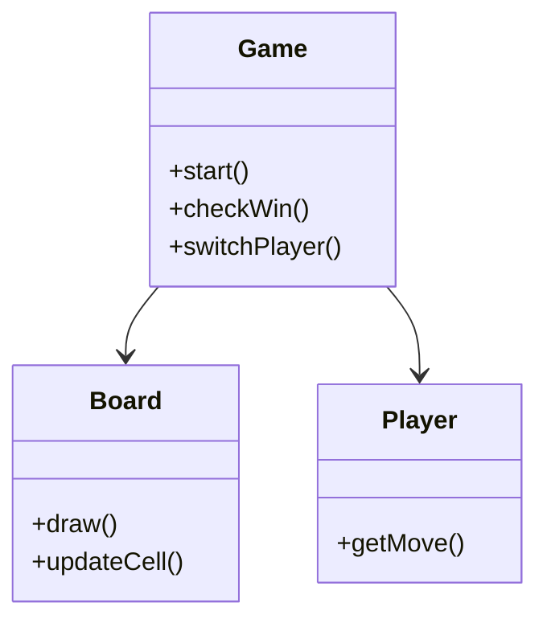

# ❌⭕ Tic-Tac-Toe in Modern C++ (C++17)

A clean, object-oriented Tic-Tac-Toe game written in Modern C++.

This project focuses on **game engine design**, **input validation**, and **modular class architecture**.

---

## 🚀 Features

- AI vs Player mode
- Error-free input validation
- Clear board rendering
- Fully modular design

---

## 🧩 Architecture Overview



---

## 🛠️ Build Instructions

### Build

```bash
mkdir build && cd build
cmake ..
make
```

### Run

```bash
./tic_tac_toe
```

---

## 💡 What I Learned

- Object-oriented design
- Encapsulation & clean class responsibilities
- Separation of UI and logic

---

## 🚧 Future Improvements

- Add Minimax AI
- Add GUI using SFML
